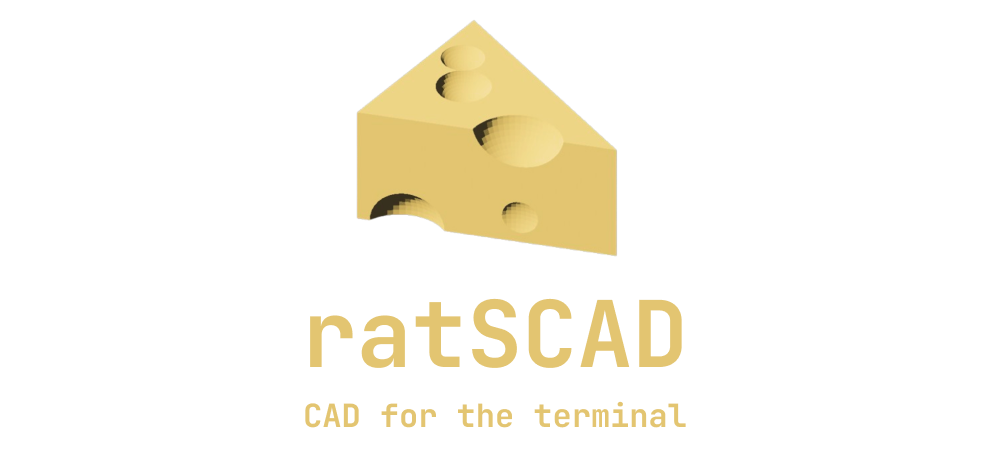
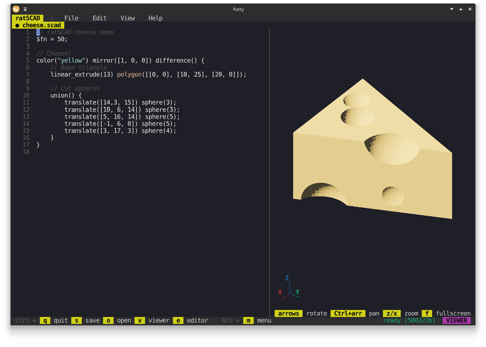

**ratscad** is a terminal-based IDE for [OpenSCAD](https://openscad.org/) with a live, hardware-accelerated 3D preview rendered directly in the terminal. It's built with Rust, [Ratatui](https://ratatui.rs) and the [Ratty Graphics Protocol](https://github.com/orhun/ratty) for inline 3D objects.



> [!WARNING]
> ratscad is currently **experimental**. Please open an issue for any bugs or crashes you encounter.

## Features

- **Tabbed editor** with syntax highlighting, dirty marker, and click-to-switch tab bar
- **Live 3D preview** of the active document, rendered inline via the Ratty Graphics Protocol
- **Debounced background builds** via the `openscad` CLI (binary STL on stdout → OBJ → Ratty payload)
- **Per-document build cache** so switching tabs without edits doesn't trigger a rebuild
- **Mouse + keyboard camera** — drag to rotate, scroll to zoom, arrows / Ctrl+arrows / `z`/`x` from the keyboard
- **Isometric default view** with a live 2D axis gizmo (X/Y/Z) in the corner
- **PBR-shaded meshes** with flat per-face normals derived from OpenSCAD's STL output
- **File menu popup** with New / Open / Save / Save As / Close / Quit
- **On-disk save/load** via a centered path prompt
- **Fullscreen viewer toggle** (`f` while the viewer is focused)
- **Bottom toolbar** showing the currently relevant shortcuts in reverse-video chips

## Running

ratscad targets the [Ratty](https://github.com/orhun/ratty) terminal emulator. Its 3D payload protocol is what makes the inline mesh preview possible; any other terminal will just see the editor with an empty preview pane.

The wrapper script clones Ratty into `references/ratty/` (if it isn't there yet), builds both binaries and launches `ratty -e ratscad`:

```bash
./scripts/run-in-ratty.sh
```

Requirements:

- Rust toolchain with Cargo
- `openscad` binary on `PATH` (older versions without OBJ export are supported via a binary STL → OBJ converter)
- A GPU / graphics stack supported by Bevy and wgpu (for Ratty's renderer)

## Key Bindings

### Global

| Key | Action |
|-----|--------|
| `Ctrl + q` | Quit |
| `Ctrl + t` | New tab |
| `Ctrl + w` | Close active tab (last tab kept open) |
| `Ctrl + o` | Open a file (centered path prompt) |
| `Ctrl + s` | Save active document; falls back to Save As if untitled |
| `Ctrl + Shift + s` | Save As (prompt for a new path) |
| `Ctrl + 1`…`Ctrl + 9` | Jump to tab N |
| `Alt + h` / `Alt + l` | Previous / next tab |
| `Ctrl + v` | Focus the viewer |
| `Ctrl + e` | Focus the editor (also exits fullscreen) |
| `Alt + m` | Focus the menubar |

### Menubar focus (after `Alt + m`)

| Key | Action |
|-----|--------|
| `←` / `→` | Cycle between File / Edit / View / Help |
| `↓` / `Enter` | Open the active menu |
| `Esc` | Return to editor |

### File menu popup

| Key | Action |
|-----|--------|
| `↑` / `↓` | Navigate items |
| `Enter` | Activate |
| `Esc` | Close |

### Path prompt (Open / Save As)

| Key | Action |
|-----|--------|
| Any printable char | Append to path |
| `Backspace` | Delete last char |
| `Enter` | Submit |
| `Esc` | Cancel |

### Viewer focus (after `Ctrl + v`)

| Key | Action |
|-----|--------|
| `←` / `→` / `↑` / `↓` | Rotate the mesh (5° per press) |
| `Ctrl` + arrow | Pan the mesh (20px per press) |
| `z` / `x` | Zoom in / out |
| `f` | Toggle fullscreen viewer |

### Mouse

| Gesture | Action |
|---------|--------|
| Click a tab name | Switch to that tab |
| Click + drag inside the viewer | Rotate the mesh |
| Scroll inside the viewer | Zoom in / out |
| Click inside the editor | Move the cursor |

## Architecture

ratscad runs as two threads bridged by `std::sync::mpsc` channels:

```
                ┌──────────────────────────────────┐
                │           UI thread              │
                │  ratatui draw + crossterm input  │
                │  tabbed editor + preview pane    │
                └──────┬───────────────────┬───────┘
                       │                   │
                       │                   ▼
                       │           SourceChanged(text)
                       │                channel
                       │                   │
                       ▲                   ▼
                MeshMsg::{Started,    ┌────────────────────┐
                  Ready{src, bytes},  │   Build thread     │
                  Failed}             │   debounce +       │
                       │              │   openscad child   │
                       └──────────────┴────────────────────┘
                                          │
                                          ▼
                                 openscad subprocess
                                  stdin: SCAD text
                                  stdout: binary STL
```

### UI thread

Owns the whole `App` (focus state, layout rects, popup state) and the `EditorPane` (a `Vec<Document>`). Runs the ratatui draw loop and dispatches crossterm key/mouse events through a precedence stack: prompt popup → menu popup → global `Ctrl`/`Alt` shortcuts → focus-specific handlers. Writes RGP escape sequences (`register_payload`, `update`, `delete`) to stdout via `ratatui-ratty` so the inline 3D mesh stays in sync with the active document.

### Build thread

Receives source snapshots over an mpsc `Sender<String>`. Coalesces rapid edits with a ~400 ms debounce window, then spawns `openscad - -o - --export-format binstl`, pipes the snapshot to stdin and reads binary STL from stdout. The STL is parsed in-process (deriving the triangle count from the file size, since OpenSCAD zeroes the count field when the target is stdout), rotated from OpenSCAD's Z-up convention into Bevy's Y-up convention, and re-emitted as an OBJ with one `vn` per triangle for flat shading. The resulting bytes flow back to the UI thread inside `MeshMsg::Ready { source, bytes }` so the cache can be attributed to the correct document.

### Build cache

Each `Document` keeps a `cached: Option<(String, Vec<u8>)>` pair. When a `Ready` message arrives, the bytes are stored on whichever document's `last_text` matches the built source. On a tab switch the new active document's cache is consulted first — if its cached source matches `last_text`, the bytes are re-registered with Ratty directly and no subprocess work happens. Edits invalidate the cache implicitly because `cached.source` no longer equals `last_text`.

### Module layout

```
src/
├── main.rs              entry point + crossterm setup
├── app.rs               App struct, layout, focus, popup dispatch
├── events.rs            MeshMsg + crossterm poll helper
├── status.rs            bottom toolbar + build status + focus chip
├── prompt.rs            centered text-input popup (Open / Save As)
├── menu.rs              File menu popup + MenuAction
├── build/
│   ├── mod.rs           BuildCoordinator: debounce + worker thread
│   └── openscad.rs      subprocess + binary STL → OBJ converter
├── editor/
│   ├── mod.rs           EditorPane: multi-doc dispatch + tab bar
│   └── document.rs      Document: name / path / editor / dirty / cache
└── preview/
    ├── mod.rs           PreviewPane: RattyGraphic wrapper + camera
    ├── camera.rs        drag → rotation, scroll → scale math
    └── gizmo.rs         2D axis gizmo via ratatui Canvas
```

## License

ratscad is licensed under the MIT license.
