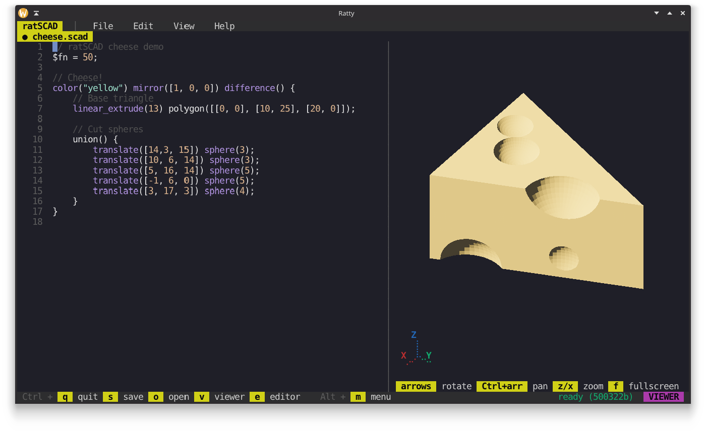

**ratscad** is a terminal-based IDE for [OpenSCAD](https://openscad.org/) with a live, hardware-accelerated 3D preview rendered directly in the terminal. It's built with Rust, [Ratatui](https://ratatui.rs) and the [Ratty Graphics Protocol](https://github.com/orhun/ratty) for inline 3D objects.



<div>
  <video src="https://github.com/user-attachments/assets/7fe31947-b734-4d19-9fba-ef606cc7b975" alt="Ratscad Demo"/>
</div>

> [!WARNING]
> ratscad is currently **experimental**. Please open an issue for any bugs or crashes you encounter.

## Features

- **Tabbed editor** with syntax highlighting, dirty marker, and click-to-switch tab bar
- **Live 3D preview** of the active document, rendered inline via the Ratty Graphics Protocol
- **Debounced background builds** that call the `openscad` CLI and pipe the result back to Ratty
- **Per-document build cache** so switching tabs without edits doesn't trigger a rebuild
- **Mouse and keyboard camera** with drag-to-rotate, scroll-to-zoom, and arrow / Ctrl+arrow / z / x keys
- **Isometric default view** with a live X/Y/Z axis gizmo in the corner
- **PBR-shaded meshes** with flat per-face normals derived from OpenSCAD's STL output
- **File menu popup** with New, Open, Save, Save As, Close, Quit
- **On-disk save/load** via a centered path prompt
- **Fullscreen viewer toggle** (`f` while the viewer is focused)
- **Bottom toolbar** showing the currently relevant shortcuts in reverse-video chips

## Installation

Install the published crate with Cargo:

```bash
cargo install ratscad
```

Requirements:

- `openscad` on `PATH`, or set `OPENSCAD_BIN` to point at a specific binary. On Linux x86_64 ratscad will download a recent OpenSCAD snapshot automatically on first run, so this is only required on other platforms for now.
- A GPU and graphics stack supported by Bevy and wgpu (for Ratty's renderer)

## Running

ratscad targets the [Ratty](https://github.com/orhun/ratty) terminal emulator. Its 3D payload protocol is what makes the inline mesh preview possible; any other terminal will just see the editor with an empty preview pane.

If you installed `ratscad` from `crates.io`, launch it from Ratty:

```bash
ratty -e ratscad
```

For local development, the wrapper script clones Ratty into `references/ratty/` (if it isn't there yet), builds both binaries and launches `ratty -e ratscad`:

```bash
./scripts/run-in-ratty.sh
```

Development requirements:

- Rust toolchain with Cargo

## Key Bindings

### Global

| Key | Action |
|-----|--------|
| `Ctrl + q` | Quit |
| `Ctrl + t` | New tab |
| `Ctrl + w` | Close active tab (last tab kept open) |
| `Ctrl + o` | Open a file (centered path prompt) |
| `Ctrl + s` | Save active document; falls back to Save As if untitled |
| `Ctrl + Shift + s` | Save As (prompt for a new path) |
| `Ctrl + 1`…`Ctrl + 9` | Jump to tab N |
| `Alt + h` / `Alt + l` | Previous / next tab |
| `Ctrl + v` | Focus the viewer |
| `Ctrl + e` | Focus the editor (also exits fullscreen) |
| `Alt + m` | Focus the menubar |

### Menubar focus (after `Alt + m`)

| Key | Action |
|-----|--------|
| `←` / `→` | Cycle between File / Edit / View / Help |
| `↓` / `Enter` | Open the active menu |
| `Esc` | Return to editor |

### File menu popup

| Key | Action |
|-----|--------|
| `↑` / `↓` | Navigate items |
| `Enter` | Activate |
| `Esc` | Close |

### Path prompt (Open / Save As)

| Key | Action |
|-----|--------|
| Any printable char | Append to path |
| `Backspace` | Delete last char |
| `Enter` | Submit |
| `Esc` | Cancel |

### Viewer focus (after `Ctrl + v`)

| Key | Action |
|-----|--------|
| `←` / `→` / `↑` / `↓` | Rotate the mesh (5° per press) |
| `Ctrl` + arrow | Pan the mesh (20px per press) |
| `z` / `x` | Zoom in / out |
| `f` | Toggle fullscreen viewer |

### Mouse

| Gesture | Action |
|---------|--------|
| Click a tab name | Switch to that tab |
| Click + drag inside the viewer | Rotate the mesh |
| Scroll inside the viewer | Zoom in / out |
| Click inside the editor | Move the cursor |

## Architecture

ratscad has two threads.

The UI thread runs the ratatui draw loop, handles keyboard and mouse input, and owns everything you can see on screen: tabs, focus, popups, the editor buffer, the preview pane, the console. The build thread spends most of its time blocking on a channel. When source text arrives it waits out a short debounce window, spawns OpenSCAD, pipes the SCAD source into stdin, and reads binary STL back from stdout. The STL gets parsed and rewritten in-process as an OBJ (with vertex normals so Bevy's PBR shader has something to light, and a Z-up to Y-up axis swap so the model sits the right way around in Bevy's coordinate system). The OBJ bytes flow back to the UI thread, which hands them to Ratty via the inline-graphics protocol.

There's a per-document build cache so switching tabs without editing doesn't kick off another OpenSCAD run. Each document keeps the last built source string alongside its OBJ bytes; on tab switch we compare the document's current text against its cached source, and if they match we re-register the cached bytes with Ratty and skip the subprocess entirely. Edits invalidate the cache implicitly, because the cached source no longer equals the current text.

The build worker needs a path to the openscad binary. On first run, if no binary is cached, ratscad shows an install popup and downloads the official OpenSCAD nightly AppImage for Linux x86_64 from `files.openscad.org`. macOS and Windows currently fall back to whatever `openscad` is on `PATH`. The `OPENSCAD_BIN` environment variable overrides either path if you want to point at a specific build.

Code is laid out as `src/main.rs` and `src/app.rs` at the top, with `src/core/` holding the openscad subsystem and persisted settings, and `src/ui/` holding the editor, preview, console, popups, menubar and toolbar.

## License

ratscad is licensed under the MIT license.
